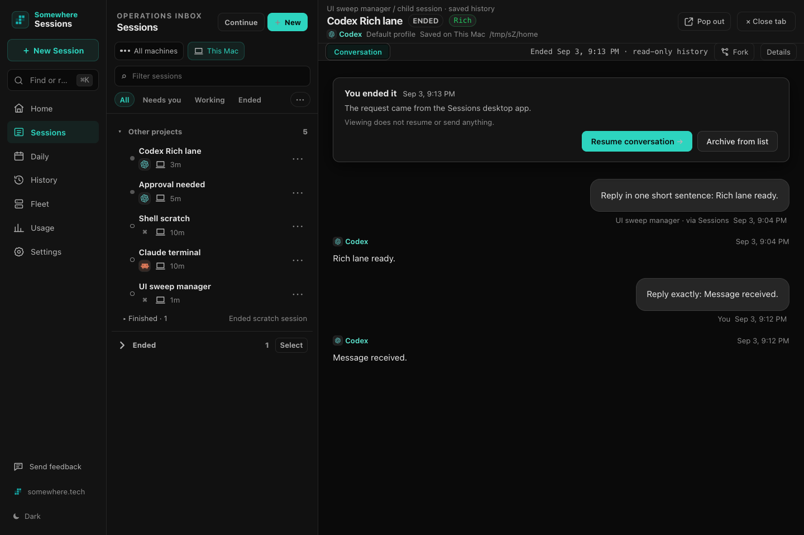
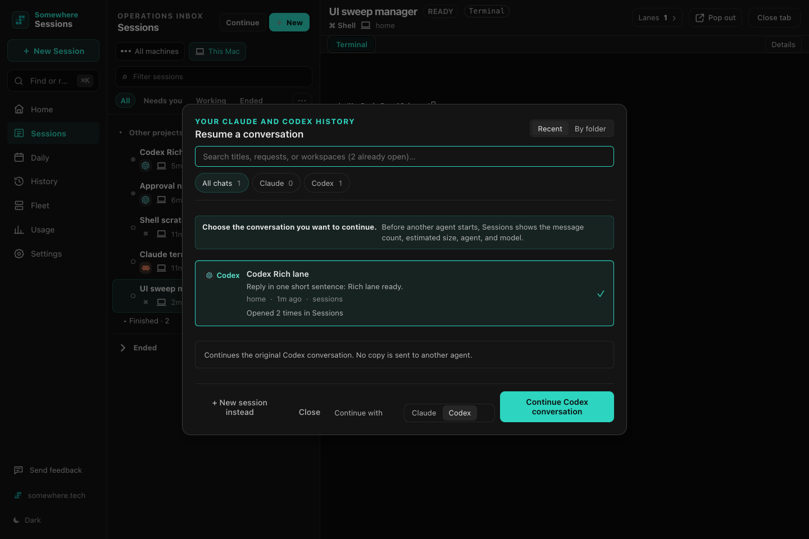
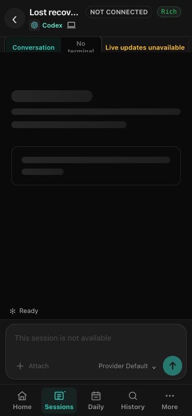
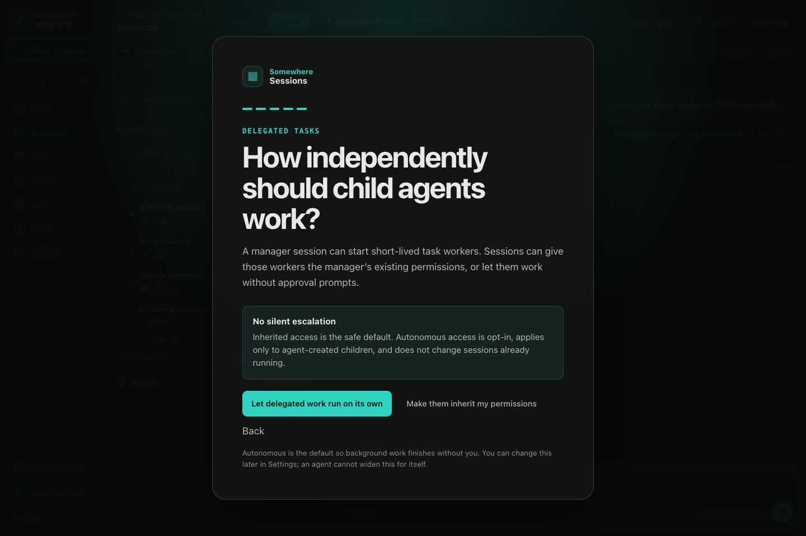
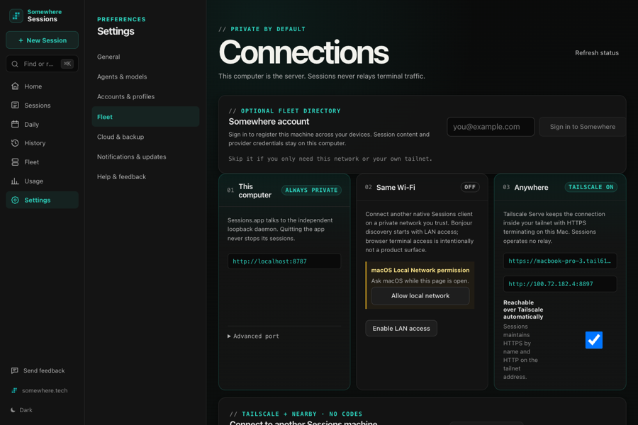
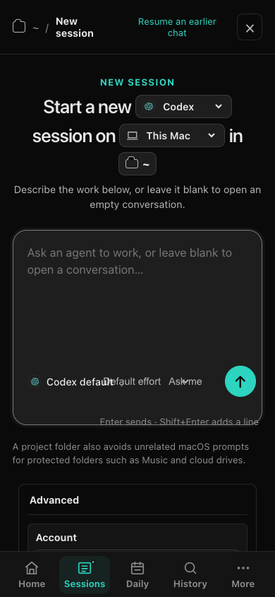
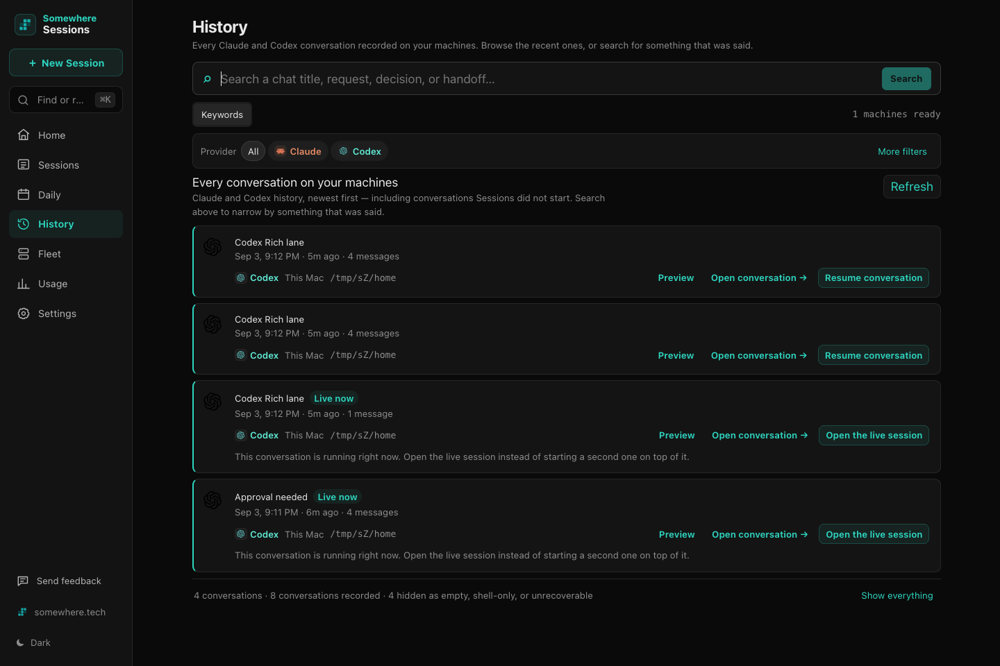
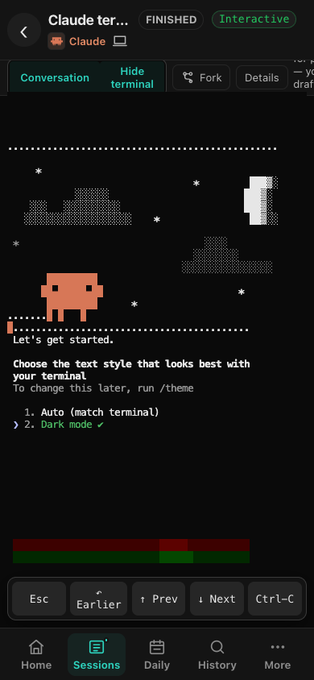
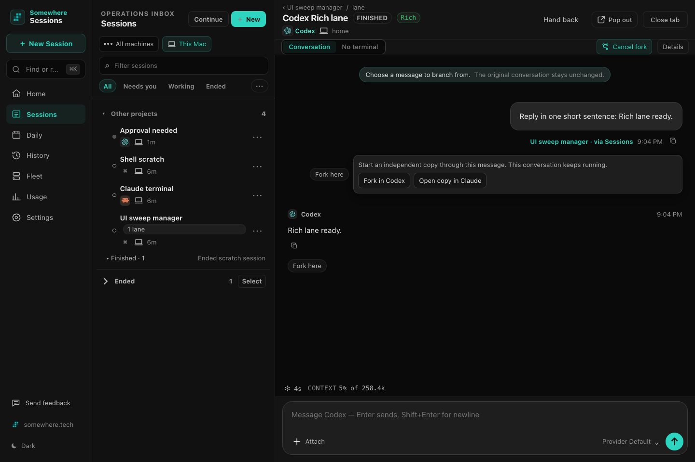
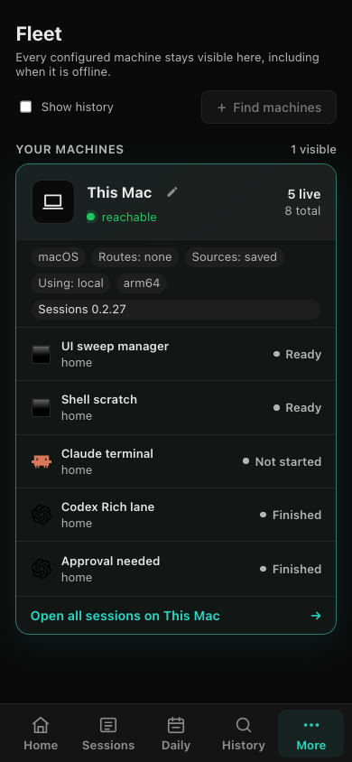

# UI friction sweep — 2026-09-03

## Method and evidence boundary

I built the production frontend and served it from a fully isolated daemon at `http://127.0.0.1:8897`, with `HOME`, runner state, and ledger all under `/tmp/sZ`. I drove that build with the repository's Puppeteer setup at 1440 × 960 and 390 × 844.

The scratch fleet contained a Rich Codex child lane with a completed real turn, a constrained Rich Codex session that raised a real command approval, a Claude terminal, a shell, an ended shell, an ended Codex conversation, and a deliberately disconnected Codex runner whose provider history was preserved. I sent and received a real Codex message, declined the approval, forked a conversation, ended and resumed a conversation, and recovered the disconnected conversation through the UI path that was available.

The web harness cannot invoke native-only discovery, pairing, or move commands, and no second scratch machine was available. I inspected their rendered entry points and disabled states but did not execute a machine pairing or cross-machine move. I inspected the cross-provider continuation confirmation without starting Claude because the isolated Claude home stopped at its first-run appearance picker. No real Sessions daemon or real session was contacted.

## Ordered top ten

### 1. Ended-session Resume bypasses the model confirmation

- **Screen and control:** ended Codex conversation → `Resume conversation →`.
- **Expected:** a review step naming the destination agent, model, effort, runtime, access, and whether history will be copied before a new paid agent runtime starts.
- **What happens:** the control immediately created a new Rich Codex runtime using implicit defaults. There was no dialog or intermediate state to review. The resulting session reported `Model: Provider default` only after launch.
- **On-screen text:** `Viewing does not resume or send anything.` followed by `Resume conversation →`.
- **Severity:** **scares**.

**Proposed lane-sized fix:** Route this button through the same continuation-choice surface used by the global Continue flow. Preselect same-provider Codex and Rich, but show the resolved model, effort, access, and runtime and require an explicit `Start` click. Keep the existing one-click behavior only behind a clearly named secondary action if it is still needed.

### 2. Same-provider Continue promises model disclosure, then omits it

- **Screen and control:** Sessions inbox → `Continue` → select an ended Codex conversation.
- **Expected:** the safety promise at the top to be fulfilled for every destination, including same-provider resume.
- **What happens:** the selected state names only Codex. It does not show the model, effort, Rich/Terminal runtime, or access policy before `Continue Codex conversation` starts the runtime.
- **On-screen text:** `Before another agent starts, Sessions shows the message count, estimated size, agent, and model.` but the selected state says only `Continues the original Codex conversation. No copy is sent to another agent.`
- **Severity:** **scares**.

**Proposed lane-sized fix:** Give same-provider continuation a compact plan row parallel to the cross-provider plan: resolved model and effort, selected runtime, access, and conversation size. Keep the wording about preserving the original conversation, but do not make same-provider resume an information-poorer branch.

### 3. A lost conversation has no recovery action and contradicts its own state

- **Screen and control:** Sessions → `Not connected` → open `Lost recovery demo`.
- **Expected:** an immediate explanation that history is safe, why the runtime is unavailable, and a prominent recovery action.
- **What happens:** the header says `NOT CONNECTED`, a tab says `Live updates unavailable`, the footer says `Ready`, and the disabled composer says `This session is not available`. There is no Resume or Recover action. Details says the saved conversation remains available but offers only `End session`; the working recovery path was End, reload, then Resume.
- **On-screen text:** `NOT CONNECTED`, `Live updates unavailable`, `Ready`, and `This session is not available`.
- **Severity:** **blocks**.

**Proposed lane-sized fix:** Replace the empty live view with a recovery card driven by the lost status: `The runner is gone. Your Codex conversation is saved.` Add `Resume conversation…` as the primary action and `Close lost record` as a secondary action. Suppress the Ready footer and composer while disconnected, and route Resume through the confirmation plan.

### 4. Onboarding gives opposite answers about the delegated-access default

- **Screen and control:** onboarding step 5 → delegated task access choice.
- **Expected:** one unambiguous statement of what happens if the person accepts the highlighted/default choice.
- **What happens:** the callout says inherited access is the default and autonomous is opt-in; the footnote says autonomous is the default. The prominent button is autonomous, so a nervous person cannot tell which statement to trust.
- **On-screen text:** `Inherited access is the safe default. Autonomous access is opt-in` and `Autonomous is the default so background work finishes without you.`
- **Severity:** **scares**.
- **Fixed:** `aff2deb`.

**Proposed lane-sized fix:** Make the copy match the implemented default. If autonomous remains the product default, say `Inherited access is the safer alternative` instead of `the safe default`, label the autonomous choice `Default`, and state in the same block that agent-created children may run commands without asking.

### 5. Connections reports the wrong loopback daemon

- **Screen and control:** Settings → Fleet → Connections → `This computer`.
- **Expected:** the endpoint of the daemon currently backing the screen, or an explicit distinction between the current web connection and a separately configured native-app port.
- **What happens:** while the UI and all evidence requests were connected to isolated port 8897, the card displayed `http://localhost:8787`. The Anywhere card on the same page displayed a tailnet address ending in `:8897`, making the disagreement visible on one screen.
- **On-screen text:** `Sessions.app talks to the independent loopback daemon` and `http://localhost:8787`.
- **Severity:** **scares**.
- **Fixed:** `8dea1a4`.

**Proposed lane-sized fix:** In a web-served build, derive the local endpoint from the active server/origin. Read a native configured port only inside the signed-app bridge, and label it `Sessions.app configured endpoint` if it differs from the connection currently being viewed.

### 6. Phone New Session collapses the safety controls into overlapping text

- **Screen and control:** phone width → New Session → Codex → composer footer and Advanced.
- **Expected:** model, effort, and access to remain separately legible and tappable before Start.
- **What happens:** `Codex default`, `Default effort`, and `Ask me` run into one another, while `Enter sends · Shift+Enter adds a line` sits on the composer border. The access choice that decides whether commands require approval is the least readable part of the primary action area.
- **On-screen text:** `Codex default`, `Default effort`, `Ask me`, and `Enter sends · Shift+Enter adds a line`.
- **Severity:** **blocks**.
- **Fixed:** `586fbce`.

**Proposed lane-sized fix:** At phone widths, wrap configuration into two labeled rows above the Start button, with each control owning a minimum tap width. Move the keyboard hint below the composer rather than absolutely positioning it on the border. Add a 390 px screenshot assertion for non-overlap and in-viewport bounds.

### 7. History presents indistinguishable copies as separate resumable conversations

- **Screen and control:** History → unfiltered conversation list → either `Resume conversation` button on the first two cards.
- **Expected:** one provider conversation, or enough run identity to choose deliberately between multiple retained records.
- **What happens:** two cards have the same title, timestamp, message count, provider, machine, folder, and actions. A person cannot predict whether the buttons resume the same provider conversation or two distinct copies.
- **On-screen text:** both cards read `Codex Rich lane`, `Sep 3, 9:12 PM · 5m ago · 4 messages`, and `Resume conversation`.
- **Severity:** **confuses**.
- **Fixed:** `67232a8`.

**Proposed lane-sized fix:** Roll records sharing one provider-conversation identity into one History card, as keyword Search already does with `opened N times in Sessions`. Put the individual runtime records behind an expandable `Runs` disclosure for audit use.

### 8. Claude is waiting for a choice while Sessions says Finished

- **Screen and control:** phone → Claude terminal → provider first-run appearance picker.
- **Expected:** `Needs you` with a short reason, because Claude is visibly waiting for a numbered choice before work can begin.
- **What happens:** the header says `FINISHED`. Sessions does switch to the exact terminal and expose directional controls, but the inbox and status badge make the blocking setup look complete.
- **On-screen text:** `FINISHED` beside Claude, while the terminal says `Choose the text style that looks best with your terminal`.
- **Severity:** **confuses**.

**Proposed lane-sized fix:** Extend the existing picker detection to classify this Claude first-run appearance prompt as Needs you and surface `Choose Claude's terminal appearance`. Preserve the automatic terminal switch and mobile picker controls, which are useful once the status is truthful.

### 9. Fork is a paid-runtime start with no model, runtime, or access preflight

- **Screen and control:** Rich Codex conversation → Fork → `Fork here` → `Fork in Codex` or `Open copy in Claude`.
- **Expected:** the copy boundary plus the model, runtime, access, and amount of imported history before a new provider runtime starts.
- **What happens:** the provider button executes immediately. The tested Codex copy reported `model provider default` only after creation, and its access resolved to Ask me even though the source lane had full access.
- **On-screen text:** `Start an independent copy through this message. This conversation keeps running.`
- **Severity:** **scares**.

**Proposed lane-sized fix:** Insert a compact fork plan after provider choice and before creation. Reuse the continuation model picker and show provider, resolved model/effort, Rich or Terminal, access, and authored-message count. The final button should include the provider and model.

### 10. Fleet's primary discovery action is disabled without saying why

- **Screen and control:** Fleet → `+ Find machines` in the web-served UI.
- **Expected:** discovery to start, or an inline explanation that this action requires Sessions.app with a clear next step.
- **What happens:** the main action is disabled and provides no visible reason. The same native-only boundary also prevents the browser harness from reaching pairing and move dialogs.
- **On-screen text:** `+ Find machines`.
- **Severity:** **blocks**.
- **Fixed:** `8a40a19`.

**Proposed lane-sized fix:** Render a truthful unavailable state instead of a silent disabled button: `Find machines in Sessions.app` plus an app-open action when supported. On web, keep the current fleet readable and point to the exact native Settings → Fleet destination for discovery, pairing, and move.

## Everything else noticed

- A top-level Codex approval says `The lane wants to run a command`; this session was not a lane.
- Immediately after Decline, the approval card disappears and the screen returns to `WORKING` without an inline `Declined` audit acknowledgement; the agent explains the denial only later.
- An action performed from the web-served UI is recorded in ended history as `The request came from the Sessions desktop app.`
- Connections at 390 px overflows horizontally: the Somewhere account text, email field, and action extend beyond the right edge.
- Daily counts the Claude setup-picker session under `What was worked on` even though it never reached a user request.
- Home says `Your agents are quiet` while Claude is waiting at a setup picker; this follows the same Finished misclassification.
- History labels the machine `This Mac`, while its read-only conversation reader labels the same source `MacBook Pro (3)`.
- Codex's Conversation/Terminal choice is hidden under Advanced in New Session, so the runtime consequence is absent from the primary review line.
- Rich sessions show a disabled-looking `No terminal` tab beside `Conversation`; it resembles a view choice even though it is only a limitation label.
- The Rich-session explanation leads with developer vocabulary such as `structured interface`, `screen-read status`, and `runtime` before the person's task or recovery action.
- Fleet metadata such as `Sources: saved`, `Routes: none`, and `Using: local` reads like diagnostics rather than a person's connection status.
- The phone inbox truncates the pinned approval summary to `Allow? Run /bin/...`, hiding the command that makes the decision meaningful until the session is opened.
- Move-to-another-computer could not be executed in this evidence boundary: it is absent in web mode and there was no second isolated machine.

## What already works well

- Cross-provider Continue is the strongest safety pattern in the UI: it names Claude and `Fable 5`, shows effort, message count, estimated tokens, history scope, and says `Nothing is sent until you press Start`.
- The approval card shows the exact command and working directory and offers `Allow once`, `Allow for this session`, and `Decline` without accepting on silence.
- Sending a Rich message gives an immediate authored-message record, a visible working state, and a clear final reply.
- End Session has a two-step confirmation that says the agent stops but the conversation remains resumable.
- Keyword Search rolls repeated Sessions runs into one result, reports total matches versus shown matches, and opens a clearly read-only transcript at the matched message.
- The lost-runner transcript and same-provider history were genuinely preserved; once the record was ended and resumed, the original prompt and answer were still present.
- The phone terminal gives useful Esc, Earlier, Prev, Next, and Ctrl-C controls for provider pickers.
- Onboarding's Remote Control step clearly explains the Anthropic connection, subscription use, and that existing sessions are not restarted.
